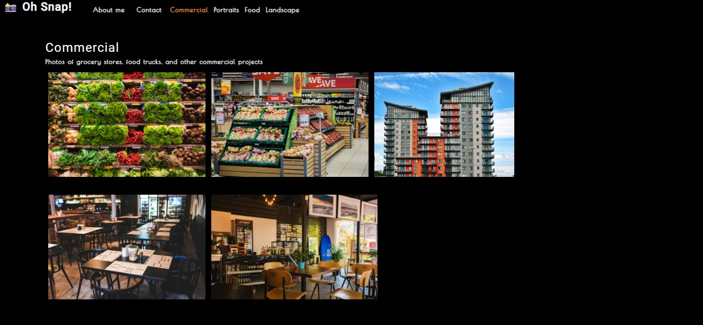

# Photo Port

### Description
This front-end React.js application is a photogrophy portfolio where components are conditionally rendered to create a great UI.

### License

This application is licensed under MIT

### Application Demo

### Table of Contents
- [Description](#description)
- [Contributing](#contributing)
- [Tests](#tests)
- [Questions?](#questions)

### Contributing
No contributions at this time.

### Tests
N/A

### Questions
GitHub Username: (kcaseychamberlain) 

View the project in GitHub at: https://github.com/KCaseyChamberlain/photo-port

View the application live hosted at: https://kcaseychamberlain.github.io/photo-port/
    
If you have any questions, contact Casey at: caseygchamberlain@gmail.com